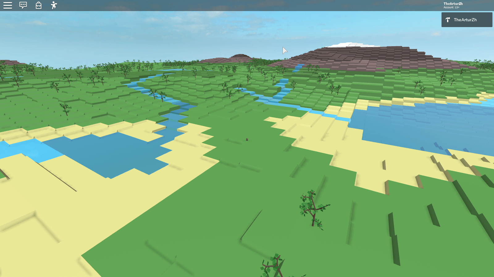
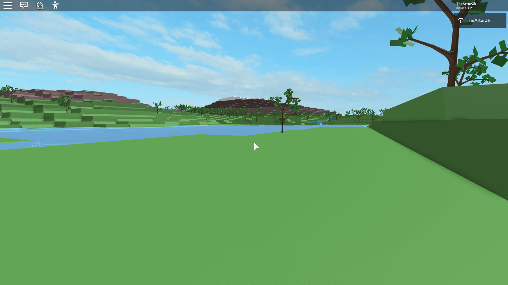

# TheArturZh's Procedural Terrain Generator

Created using [**Rojo**](https://github.com/rojo-rbx/rojo)

This is a procedural terrain generator, that doesn't utilize default Roblox terrain. It's designed to be orthogonal and easy to integrate into other projects. This generator can generate not only a terrain, but also rivers, lakes and forests. Generator uses exponentially destributed Perlin noise with domain warping to generate a heightmap.





## License explaination

This project is under MIT License, and it means that you are free to develop a closed-source version of this project without having to contribute back or attribute. Attribution is only required if you'll decide to make your version open-source.

## Download and usage

All modules are linked with relative pathes, and it means that they can be placed anywhere you want (keeping the original structure).

There are already built packages that you can import in Roblox Studio and .rbxlx example places in Releases tab. However, you can also build it yourself:

## Building the project

Building this project is absolutely optional, latest release can be dolwnloaded in Relseases tab.

### 1. Dependencies

To build this project you'll need **Bash**, **GNU Make**, **curl**, **unzip** utilities and Internet connection.

If you are on **Windows**, it is recommended to use **Git Bash** that comes with [Git](https://git-scm.com) (it's just simplier to install and **includes all these utilities**). If you don't want to use it, install these utilities using [MinGW Get](https://sourceforge.net/projects/mingw/) or [Cygwin](https://www.cygwin.com).

If you are on **Linux**, then all utilities except **GNU Make** are probably already installed. On Debian-based and Ubuntu-based destributions it can be installed with this command: `sudo apt-get install make`

If you are on **MacOS**, then all these utilities can be installed using [Homebrew](https://brew.sh). After you installed Homebrew, run these commands:

```bash
brew install curl
brew install make
brew install unzip
```

### 2. Building

After you'll make sure that all these utilities are installed, open Bash, go to project root directory (where Makefile is located at), and build the project using:

`make` command, that will build .rbxlx file, containing all necessary project files

`make test` command if you want to build a test place with example-of-use script.

If you are using **MacOS** and installed GNU Make using Homebrew, you should use `gmake` and `gmake test` commands instead.

The **make** utility will download all other dependencies (currently only Rojo) and build the project.
